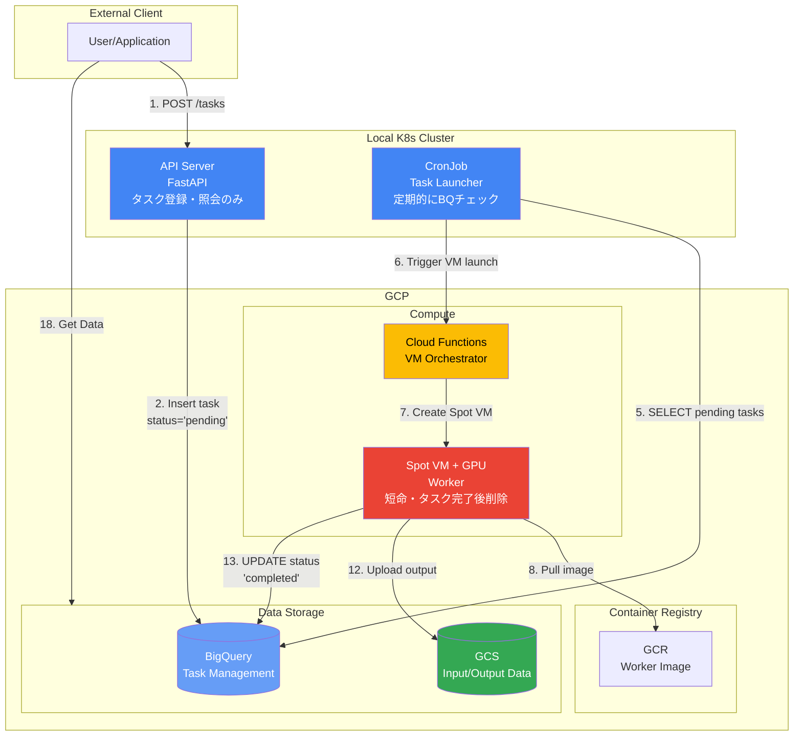

```mermaid
graph TB
    subgraph "Local K8s Cluster"
        API[API Server<br/>FastAPI<br/>タスク登録・照会のみ]
        CRON[CronJob<br/>Task Launcher<br/>定期的にBQチェック]
    end
    
    subgraph "GCP"
        subgraph DS["Data Storage"]
            BQ[(BigQuery<br/>Task Management)]
            GCS[(GCS<br/>Input/Output Data)]
        end
        
        subgraph "Compute"
            CF[Cloud Functions<br/>VM Orchestrator]
            VM[Spot VM + GPU<br/>Worker<br/>短命・タスク完了後削除]
        end
        
        subgraph "Container Registry"
            GCR[GCR<br/>Worker Image]
        end
    end
    
    subgraph "External Client"
        USER[User/Application]
    end
    
    USER -->|1. POST /tasks| API
    API -->|2. Insert task<br/>status='pending'| BQ
    
    CRON -->|5. SELECT pending tasks| BQ
    CRON -->|6. Trigger VM launch| CF
    
    CF -->|7. Create Spot VM| VM
    
    VM -->|8. Pull image| GCR
    VM -->|12. Upload output| GCS
    VM -->|13. UPDATE status<br/>'completed'| BQ
    
    USER --> |18. Get Data| DS
    
    
    style API fill:#4285f4,color:#fff
    style CRON fill:#4285f4,color:#fff
    style BQ fill:#669df6,color:#fff
    style GCS fill:#34a853,color:#fff
    style CF fill:#fbbc04,color:#000
    style VM fill:#ea4335,color:#fff
```