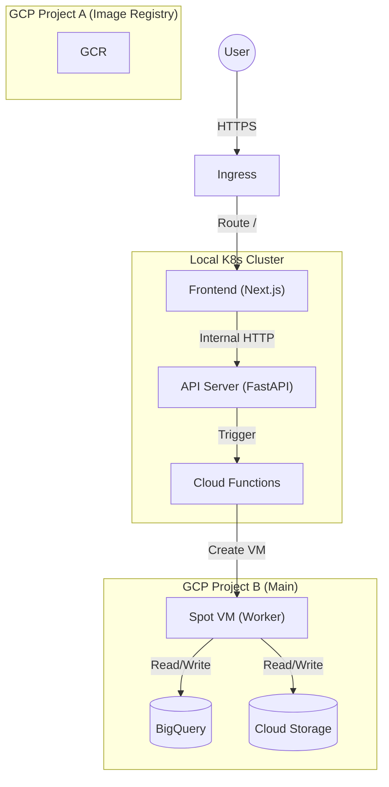

# MuSP K8s Deployment Plan

## 概要
MuSP (Music Source Separation Platform) のGCP + Kubernetes移行計画。
Frontend (Next.js) と API (FastAPI) をローカルK8s上で稼働させ、WorkerのみGCP (Spot VM) で実行するハイブリッド構成。

## アーキテクチャ

### 通信フロー
1. **User -> Frontend**: Ingress経由でNext.jsアプリにアクセス。
2. **Frontend -> API**: Next.jsのAPI Routes/Server Componentsから、K8s内部DNS (`http://musp-api`) を使ってAPIを叩く。**APIは外部公開しない。**
3. **API -> Cloud Functions**: APIが動画処理リクエストを受けると、Cloud FunctionsをトリガーしてGCE Spot VMを起動。
4. **Worker (Spot VM)**: 処理を実行し、結果をGCS/BigQueryに保存・更新。

---

## ✅ Phase 1: インフラ基盤準備 (完了)
- GCPプロジェクト設定 (Project A: Image Registry, Project B: Main Resource)
- Service Accounts作成 (`musp-api-sa`, `musp-worker-sa`, `musp-cf-sa`)
- BigQueryスキーマ設計・適用 (`videoID-status` テーブル拡張)
- ネットワーク設定 (VPC, Firewall, Cloud NAT)

## ✅ Phase 2: Worker実装 (完了)
- GPU Worker (Dockerfile, `main.py`) の実装
- 処理ロジック:
    1. YouTube Download (yt-dlp)
    2. 音源分離 (Demucs)
    3. GCS Upload
    4. BigQuery Status Update (`PROCESSING` -> `COMPLETED`)
- Dockerイメージのビルド & Push (GCR)

## ✅ Phase 3: Cloud Functions実装 (完了)
- VM Launcher (HTTP Trigger) の実装
- API Serverからリクエストを受け取り、Worker用Spot VMを起動するロジック
- デプロイ済み

---

## 🚧 Phase 4: K8sデプロイメント (Frontend & API)

本フェーズでは、ローカルK8s環境 (Minikube/Kind等) またはGKE上にアプリケーションをデプロイする。
**APIはPrivate化し、FrontendのみをPublicに公開する。**

### 4.1 コンテナイメージ準備
- [ ] **API Server**: `api/` ディレクトリからDockerイメージを作成
    - Celery/Redis依存の削除 (完了済みの想定)
    - Cloud Functions呼び出しロジックの確認
- [ ] **Frontend**: `view/` ディレクトリからDockerイメージを作成
    - Next.js スタンドアロンビルドの設定
    - 環境変数 (`API_BASE_URL`) の注入方法確認

### 4.2 K8sマニフェスト作成

#### A. Namespace & Config
- `namespace.yaml`: `musp` namespace
- `configmap.yaml`: 共通環境変数
- `secret.yaml`: GCP SA Key, Sensitive Data

#### B. API Server (Private)
外部からの直接アクセスを遮断し、クラスタ内部からのみアクセス可能にする。
- `api-deployment.yaml`:
    - Replicas: 2
    - Image: `gcr.io/PROJECT_A/musp-api:latest`
    - Env: `GOOGLE_CLOUD_PROJECT`, `DATASET_ID`, `CLOUD_FUNCTION_URL`
- `api-service.yaml`:
    - Type: **ClusterIP** (重要: LoadBalancer/NodePortにしない)
    - Port: 80 -> 8000

#### C. Frontend (Public)
ユーザーからのアクセスを受け付けるエントリポイント。
- `view-deployment.yaml`:
    - Replicas: 2
    - Image: `gcr.io/PROJECT_A/musp-view:latest`
    - Env: 
        - `API_INTERNAL_URL`: `http://musp-api:80` (サーバーサイド通信用)
- `view-service.yaml`:
    - Type: NodePort (Ingress利用時) または LoadBalancer
    - Port: 80 -> 3000

#### D. Ingress (Optional but Recommended)
- `ingress.yaml`:
    - Path `/` -> `musp-view` Service
    - SSL終端などを行う場合に使用

### 4.3 デプロイ手順
1. Docker Image Build & Push
2. Kubernetes Secret作成 (GCR Pull用, GCP Credentials)
3. Manifest Apply (`kubectl apply -k k8s/`)

---

## Phase 5: CI/CDパイプライン (GitHub Actions)
- `api`, `view`, `worker`, `cloud-functions` の変更検知
- 自動ビルド & GCR Push
- `k8s/` マニフェストの更新 (ArgoCD導入を見据える場合はImage Tag更新)

## Phase 6: 動作確認 & 結合テスト
1. FrontendからURL入力してPOSTリクエスト
2. Frontendが内部APIを叩く
3. APIがCloud Functionsを叩く
4. Worker VMが起動し、処理完了
5. Frontendでステータスが `COMPLETED` になることを確認
