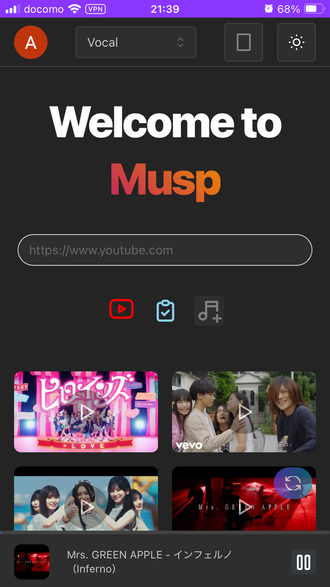

# MuSP

## Vocal Extractor with YouTube Link (v4)

<div style="display: flex; justify-content: center; gap: 10px;">
  
</div>

## Model

- [demucs](https://github.com/facebookresearch/demucs)

## Development & Deployment

### View (Frontend)

To build the View component Docker image, you must pass the `NEXT_PUBLIC_API_URL` build argument.
In the Kubernetes environment, this URL points to the internal API service.

```bash
docker build \
  --build-arg NEXT_PUBLIC_API_URL=http://musp-api.musp.svc.cluster.local \
  -t view-app ./view
```

> [!NOTE]
> `http://musp-api.musp.svc.cluster.local` is the internal DNS name for the API service within the Kubernetes cluster.
